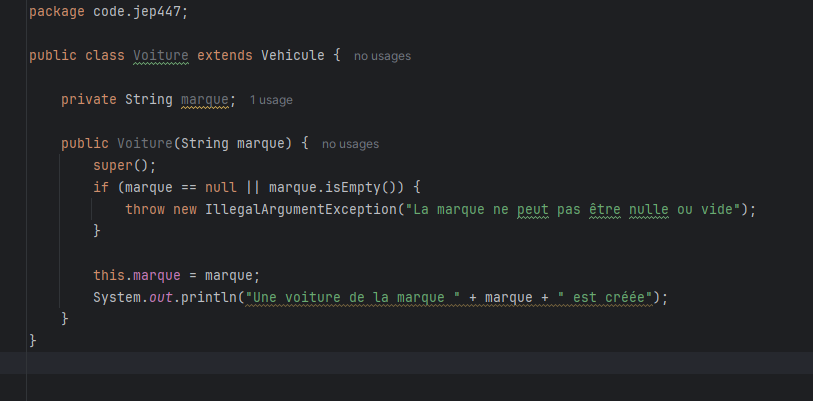
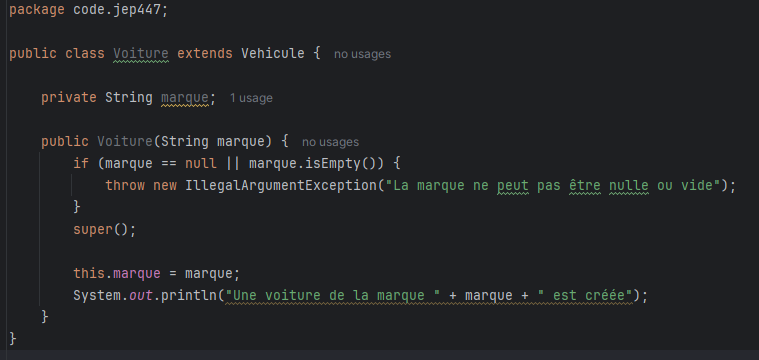

== JEP 447 Statements before super (preview)

[%notitle]
=== Contenu des parties

=== Java 21 et inférieur :

=== !
=== Avant

[.notes]
--
* Quand une classe extend une autre classe , il est nécessaire d’appeler le constructeur de la classe parente dans le constructeur
de la classe enfant. Dans ce cas, la JVM impose que cet appel soit la toute première instruction du constructeur.
* Ceci permet de s’assurer que tous les champs de la classe parente sont initialisés avant la construction de la classe enfant.
--
=== !

=== Java 22 avec la JEP 447 preview :

--
[.step]
* La JEP 447 est une fonctionnalité en *preview* qui autorise des instructions dans le corps d’un *constructeur Java*, *avant* l’appel du constructeur.
--

=== !
=== Avec la JEP447

[.notes]
--
* La fonctionnalité JEP 447, actuellement en préversion, assouplit cette règle en permettant l’exécution de certaines
instructions avant l’appel au constructeur parent, à condition que celles-ci n’interagissent pas avec l’instance en cours de création.
--
=== !

=== Conlusion
[.step]
* *La validation des arguments* ne nécessite plus l'utilation de méthodes auxiliaires
* *Les variables d'instance* de la classe enfant ne sont pas utilisées *avant* que super() *soit appelé*.
* Les champs et méthodes hérités du parent ne sont accessibles qu'*après* son initialisation.
* On peut continuer à mettre notre super() avant des instructions

[.notes]
--
* Cela ouvre la  voie à de nouvelles possibilités, telles que la validation des paramètres ou le pré-calcul des arguments, avant d’initialiser la classe parente.
--

