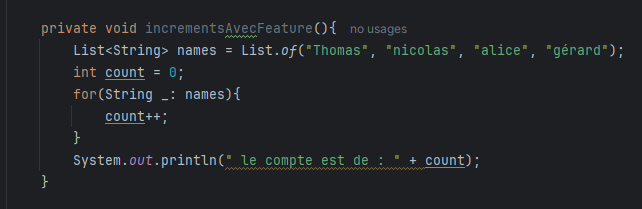
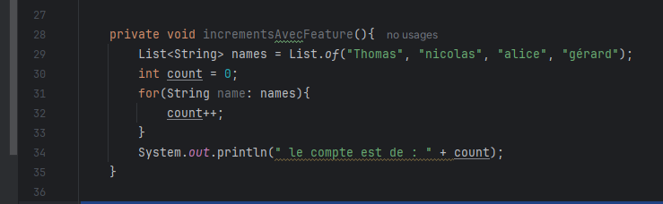
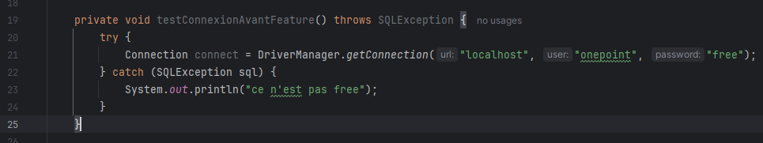
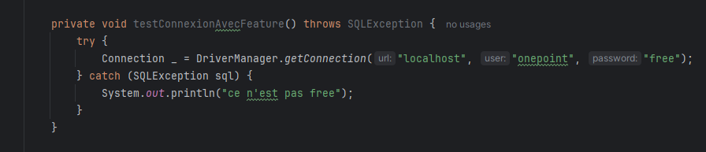

== JEP 456 – Unnamed Variables & Patterns

[%notitle]
=== Contenu des parties

--

[.step]
* permet d’utiliser _ comme pattern ou variable anonyme
--

[.notes]
--
 * Introduire dans le langage Java des variables et des motifs non nommés, représentés par le caractère souligné _.
Cela permet de déclarer des variables ou des motifs nécessaires mais jamais utilisés, clarifiant ainsi l’intention des développeurs et réduisant les erreurs potentielles.
--

=== !

=== !

=== !

=== !

=== !

=== !

=== !

=== !

[.step]
* Introduit en preview avec le JDK 21, cette fonctionnalité est *finalisée* sans modifications dans le *JDK 22*.
* *Lisibilité améliorée* en supprimant les variables inutiles.
* La variable ne rentre pas dans le scop.
* *Réduction des avertissements* de variables non utilisées lors de la compilations.
* *Meilleure gestion* du pattern matching, lorsque certains éléments du modèle ne sont pas pertinents.
* *Réduction de la charge cognitive* pour les développeurs en éliminant les variables sans intérêt.

[.notes]
--
* JEP 456 est une évolution pragmatique pour rendre le code Java plus propre et plus expressif, tout en simplifiant la gestion des variables inutiles dans des situations spécifiques.
--