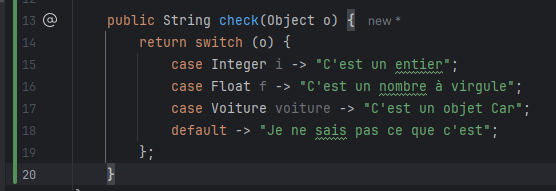

== Unnamed Variables & Patterns

[.step]
* Permet d’utiliser le caractère "_" comme pattern ou variable anonyme

[.notes]
--
* Introduit en preview avec le JDK 21, elle est finalisée dans le JDK 22.
--

=== Avant la feature

[.notes]
--
* le but est de rendre le code plus propre et plus expressif
* en simplifiant la gestion des variables non utilisée
--

=== Après la feature

[source, java]
----
public String check(Object o) {
    return switch(o) {
        case Integer _ -> "C'est un entier";
        case float  _ -> "C'est un nombre à virgule";
        case Voiture _ -> "C'est un objet Car";
        default -> "Je ne sais pas ce que c'est";
    };
}

BiFunction<Integer, String, Integer> processAOnly = (a, _) -> a * 2;
----

=== Récap

[.step]
* *Lisibilité améliorée*
* *Réduction des avertissements*
* *Réduction de la charge cognitive*

[.notes]
--
* Java a enfin pris une fonctionnalité interessante de nos amis fronteux -> oui, ca existe depuis longtemps chez eux !
* *Lisibilité améliorée* en supprimant les variables inutiles.
* *Réduction des avertissements* de variables non utilisées lors de la compilation.
* *Réduction de la charge cognitive* pour les développeurs en éliminant les variables sans intérêt.
--