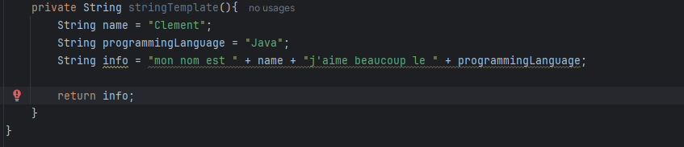
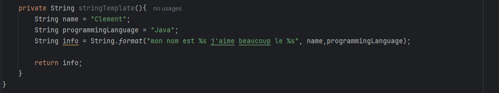
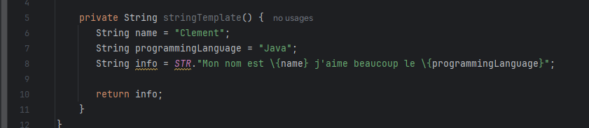
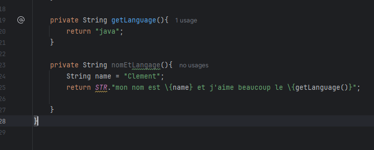

== JEP 459 String Templates (second preview)

[%notitle]
=== Contenu des parties

[.notes]
--
* un string template est un littéral de String qui vous permet d’incorporer des expressions et des variables.
--

[.step]
* STR est un *template processor*, défini par java, inclus dans la JDK
* *Interpolation* de chaîne de carractère
* methode public static final, automatiquement importé

=== Avant

=== !
=== Avant

=== !

=== !

=== !

=== !

=== !

=== !

=== !

[.step]
* *Réduire la verbosité* du code..
* *Gérer les expressions* dans des chaînes de manière plus concise.
* *Améliorer la sécurité*, en particulier dans des contextes sensibles comme SQL ou JSON.
* Personnaliser les traitements de chaînes via des *template processors*
