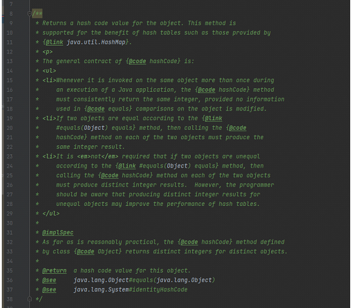
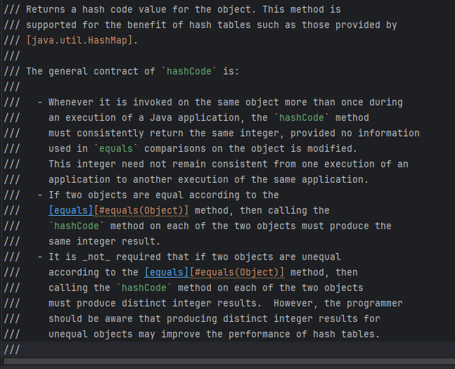

== Markdown Documentation Comments

[.notes]
--
* Markdown : on ne le présente plus, il est facile à écrire et à lire,
* Il est très largement utilisé pour la documentation, les README dans les projets..
* utiliser du Markdown dans la (Javadoc).
--

[%notitle]
=== photoAvant

[%notitle]
=== photoApres

[%notitle]
=== javaDoc

[source, java]
----
/**
 * Cette méthode prend deux entiers en entrée et retourne leur différence.
 *
 * @param x Premier entier pour le calcul.
 * @param y Deuxième entier pour le calcul.
 *
 * 
Tableau récapitulatif des paramètres :

 * <table border="1">
 *   <tr>
 *     <th>Paramètre</th>
 *     <th>Description</th>
 *   </tr>
 *   <tr>
 *     <td>x</td>
 *     <td>Premier entier pour la soustraction</td>
 *   </tr>
 *   <tr>
 *     <td>y</td>
 *     <td>Deuxième entier pour la soustraction</td>
 *   </tr>
 * </table>
 *
 * @return La différence absolue entre `x` et `y`.
 */
public int subtract(int x, int y) {
    return Math.abs(x - y);
}
----

[%notitle]
=== Contenu des parties

[source, markdown]
----
| Paramètre | Description                                  | Type  |
|-----------|----------------------------------------------|-------|
| `x`       | Premier entier pour le calcul de différence  | `int` |
| `y`       | Deuxième entier pour le calcul de différence | `int` |
| `return`  | La différence absolue entre `x` et `y`       | `int` |

----

[%notitle]
=== Avec du code

[source, markdown]
----
/// /**
///  * Bienvenue chez onepoint !
///  */
/// public class HelloWorld { }
----

=== Récap

[.step]
* *Lisibilité améliorée*
* *Moins de balises techniques*
* *Compatible* avec *JavaDoc existantes* et les *éléments HTML*.

[.notes]
--

* *Lisibilité améliorée* : Markdown est plus simple à lire directement dans le code source.
* *Moins de balises techniques* : 
, <ul>, <li>, et les autres balises HTML sont remplacées par une syntaxe beaucoup plus concise.
* *Flexibilité* : il permet tout de même d'inclure du HTML pour des structures que Markdown ne prend pas en charge nativement.
* En résumé, le JEP 467 vise à rendre la documentation Java plus accessible et plus facile à maintenir,
en offrant une alternative plus conviviale à l'HTML.
--

[%notitle]
=== Récap
[source, markdown]
----
/// Vivement la 🍺
----
