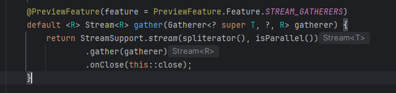

== GATHERER

[%notitle]
=== Les Streams, rappel

=== LES STREAMS :

--

[.step]
* *Java utils stream*
* les streams sont des *interface*
* il peut y avoir *plusieurs* implémentations, même si dans la plus-pars des cas on utilisera java utils stream
--

[.notes]
--
* On parle de Java utils stream,
les streams sont juste des interface, il peut y avoir plusieurs implémentation, meme si dans la prluspars des cas on utilisera java utils stream
--

=== Deux type d opérations

--
[.step]
* *intermediaire* (filter, map...)
* opération *terminal* (anymatch, findFirst, collect, count...)
--

[.notes]
--
* (filter, map...)
* on ne peut plus rien faire après (anymatch, findFirst, collect, count...)
--

=== Gatherer

--
[.step]
* *Gatherer* -> C'est une API, qui permet de définir n'importe quel *opération intermediaire*
--

=== !

=== !

=== Description

--
[.step]
* Gatherer<String, ?, String>
* la methode gather prends en parametre un gatherer
* Gatherer => type generique, qui possède 3 parametres
* Gatherer.of => permet de creer un gatherer
* notre opération intermediaire va pouvoir conserver un état, donc prendre des décisions en fonction de ce qu'il c'est passé avant ou après
--

[.notes]
--
* Gatherer<String, ?, String>
* _les données en entée
* _état éventuel qu'on peut etre amener à ajouter.
*  _les données en sortie
--

=== Description Gatherer.of

--
[.step]
* Gatherer.of() utilises *4 fonctions*
* *initializer*  permet de creer un état en fournissant un supplier (fonction qui permet de créer cet état)
* *integrator* reçoit cet état, donc il peut changer l' état pour X raisons
* *combiner* si je fais des calculs en parallèle , il faut étre capable de combiner des états pour retourner un état ( si j'ai plusieurs états sur
differents threads, comment les faire correspondre à un seul état (le combiner ça peut etre la concatenation des listes))
* *finisher* prends des états restant, et peut nous permettre de faire des opérations pour envoyer ces etats restants
--

[.notes]
--
* Creation intermediaire : Envoyer / pousser des valeurs vers l'oparation suivante
* exemple : Le filter, si le predicate renvoie vrai, alors on pousse les valeurs, si il renvoit faux, on pousse pas
--
