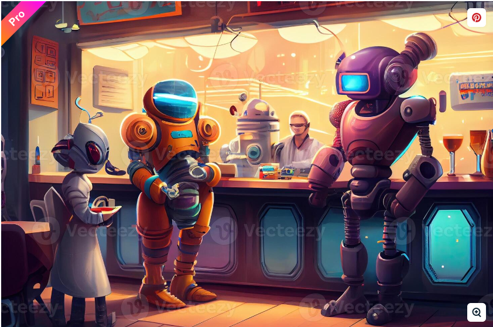

[%notitle]
== Debut

[%notitle]
=== Intro

image::images/Java-Emblem.jpg[width=500]
[role="font-size: 200px"]
_Les nouveautés Java 22 et Java 23_

[.notes]
--
--

[%notitle]
=== Contenu des parties

[.step]
* Contenu - _Parcourir les features et les previews de Java 22 et Java 23_
* Motivation - _Découvrir les nouveautés, les appliquées sur nos projets_

[%notitle.columns.is-vcentered.transparency]
=== Présentation

[.blur]
image::images/ocean.jpg[background, opacity=100%]

[.column.is-two-fifth]
--
image::images/photo.png[]
--

[.column.has-text-left]
****

[.important-text]
--
Clément MALLAMBIC

Développeur Back-End

--

image:images/onepoint.png[width=200]

[.vertical-align-middle]
icon:github[] https://github.com/Clem-mal[Github]
****

[.notes]
--
* vous retrouverez sur github :
** les *slides*
** tous les *outils évoqués* durant le talk
** et pour ceux que je vais vous montrer, un *README expliquant comment les utiliser*
--
